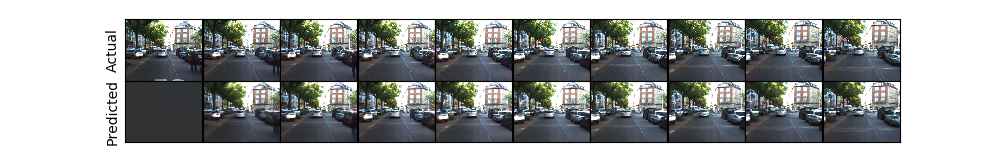

**Pytorch** implementation of PredNet.
### Original Repository

This repo was first created by [leido](https://github.com/leido/pytorch-prednet) and was a helpful starting point.  My implementation fixes the known issues of the leido's code such as blurry, black-and-white predictions.

Here's an example plot generating using [prednet_relu_bug](prednet_relu_bug.py) with default hyperparameters:

This implementation includes features not present in the [original code](https://github.com/coxlab/prednet) such as the ability to toggle on peephole connections, between tied and untied bias weights, and between multiplicative and subtractive gating as developed by [Costa et al](https://papers.nips.cc/paper/2017/file/45fbc6d3e05ebd93369ce542e8f2322d-Paper.pdf).

### Details
"Deep Predictive Coding Networks for Video Prediction and Unsupervised Learning"(https://arxiv.org/abs/1605.08104)

The PredNet is a deep recurrent convolutional neural network that is inspired by the neuroscience concept of predictive coding (Rao and Ballard, 1999; Friston, 2005)

Original paper's [code](https://github.com/coxlab/prednet) is writen in Keras. Examples and project website can be found [here](https://coxlab.github.io/prednet/).

In leido's code, ConvLSTMCell is borrowed from [here](https://gist.github.com/Kaixhin/57901e91e5c5a8bac3eb0cbbdd3aba81).

However, I significantly revamped this module with a proper implementation of peephole connections, gating options, and a more readable style.

### Current issues

Currently, this repository contains two version of PredNet: [prednet](prednet.py) and [prednet_relu_bug](prednet_relu_bug.py).  The only difference between these two versions is that prednet_relu_bug omits the ReLU activation function for the target (A) units.  When the default hyperparameters are used (as described in the [paper](https://arxiv.org/abs/1605.08104)), prednet_relu_bug significantly outperforms prednet with a lower MSE, crisper images, and  avoiding over-fitting.  However, decreasing the number of model parameters (ommiting the top-most layer) and increasing the size of the training set seems to alleviate the issue.

### Training, Validation, and Testing

Training a prednet model is done via [kitti_train.py](kitti_train.py).  Feel free to adjust the following training and model hyperparamters within the script:  

#### Training parameters
- **num\_epochs**: default- 150
- **batch\_size**: default- 4
- **lr**: learning rate, default- 0.001
- **nt**: length of video sequences, default- 10
- **n\_train\_seq**: number of video sequences per training epoch, default- 500
- **n\_val\_seq**: number of video sequenced used for validation, default- 100

#### Model hyperparameters
- **loss\_mode**: 'L\_0' or 'L\_all', default- 'L_0'
- **peephole**: toggles incluse of peephole connection w/n the ConvLSTM, default- False
- **lstm\_tied\_bias**: toggles the tieing of biases w/n ConvLST, default- False
- **gating\_mode**: toggles between multiplicative 'mul' or subtractive 'sub' gating w/n ConvLSTM, default- 'mul'
- **A\_channels & R\_channels**: number of channels within each layer of PredNet, default- (3, 48, 96, 192)

After training is complete, the script saves two versions of the model: prendet-\*-best.pt (version with the lowest loss on validation set) and prednet-\*.pt (version saved after the last epoch).

To test your models using [kitti_test.py](kitti_test.py) transfer them into your 'models' folder, set the testing and model hyperparamters accordingly, then run the script.  It should output the MSE between the GT and predicted sequences as well as the MSE if the model simply predicted the previous frame at each time step.

#### A brief word on hyperparameters

The default parameters listed above reproduce the results in the [paper](https://arxiv.org/abs/1605.08104) when using [prednet_relu_bug](prednet_relu_bug.py).  However, [prednet](prednet.py) underperforms under these parameters and overfits the data.  After a [coarse hyperparameter search](https://docs.google.com/spreadsheets/d/1-5LYZKMhMonAJnmb9t5XTLztYCSnrqe2ro0XkNei6mE/edit?usp=sharing), I found that shrinking the model helped to alleviate overfitting.  

#### Data

Acquiring the dataset requires multiple steps: 1) downloading the zip files 2) extracting and processsing the images.  Step 1 is done via running the download\_raw\_data\_<category>.sh scripts found in kitti_raw_data\raw\<category>.  Step 2 is handled by running the [process_kitti.py](process_kitty.py).

